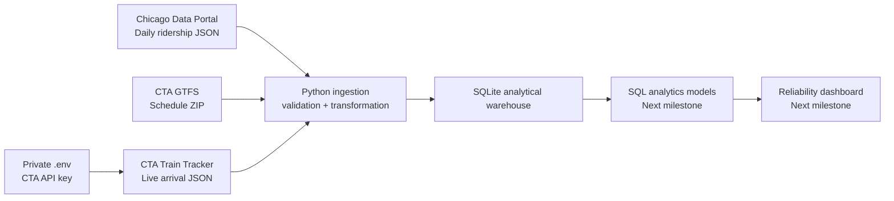

# Architecture

## Current pipeline

## Data layers

| Layer | Current tables | Purpose |
|---|---|---|
| Historical | `daily_ridership` | Long-term bus and rail demand trends |
| Schedule | `gtfs_routes`, `gtfs_stops`, `gtfs_trips`, `gtfs_stop_times` | Expected CTA rail service |
| Schedule calendar | `gtfs_calendar`, `gtfs_calendar_dates` | Days on which scheduled trips operate |
| Real time | `train_arrival_predictions` | Timestamped CTA arrival predictions |
| Audit | `gtfs_feed_metadata` | Source URL, checksum, and import time |

## Scope decision

The CTA GTFS package contains bus and rail service. This project loads only rows
whose GTFS `route_type` is `1` (rail), plus their related trips, stop times,
platforms, stations, and service calendars. That reduces unnecessary storage and
keeps the model aligned with the train reliability objective.

## Reliability model planned next

Repeated Train Tracker snapshots allow us to observe how a predicted arrival
changes as a train approaches a station. The analytics layer will calculate:

- prediction volatility by route and station;
- percentage of CTA predictions flagged as delayed;
- approaching and scheduled-prediction proportions;
- average expected wait by route, station, weekday, and hour;
- service-alert and weather context.

CTA Train Tracker provides predictions rather than a direct actual-arrival
history. Any metric described as a delay will therefore be labeled according to
its source and calculation instead of being presented as ground truth.

Safe collector usage and metric limitations are documented in
[`OPERATIONS.md`](OPERATIONS.md).
